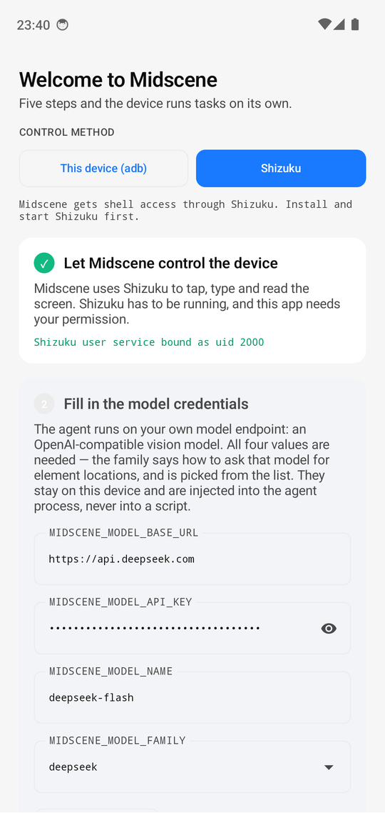
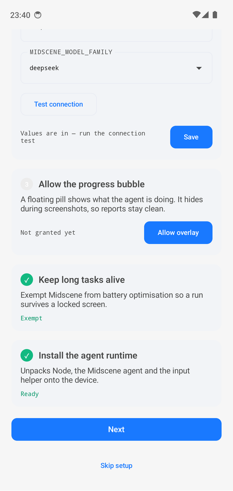

# midscene-android

**English** | [简体中文](./README.zh.md)

**Run AI visual automation entirely on the phone — no PC, no cloud.**

> ⚠️ **Community project.** This is a community extension built on
> [Midscene](https://github.com/web-infra-dev/midscene). It is **not an official
> Midscene project** and is not supported or endorsed by the Midscene team.
> Midscene is used as the underlying agent framework (MIT).
>
> On npm: this project is **`midscene-android` (unscoped)**. The official
> Android-related packages are **`@midscene/android` (scoped)** and the
> `@midscene/android-local` package. The scope is the boundary between official
> and community — please don't confuse them.

This project packages Midscene's visual agent together with everything it needs
to run — a Node runtime, the agent bundle, and an adb client — into a single
APK. Once installed, the phone can run automation scripts by itself:

- Give it a natural-language instruction and the agent looks at the screen and operates it
- Run YAML scripts for repeatable regression checks
- Inference stays on-device (you configure the model endpoint); **no data is uploaded to any third-party server we operate**

```text
natural language / YAML ──► on-device agent ──► screen understanding ──► device control
                                   ▲
                          model endpoint (yours)
```

## Why on-device

Android UI automation normally means one of two things: a script on a computer
driving the phone over a cable, or a device farm where the phone sits in someone
else's rack. This project is a third — the agent runs on the phone — and almost
everything below follows from one fact: **you do not need the computer.**

|  | This project | Computer and a cable | Device farm |
|---|---|---|---|
| To run it you need | the phone | a computer, a cable, adb | an account, and someone else's phone |
| The run is | on the phone's own screen, watched and stopped by hand | on the phone, driven from the computer | on a phone you cannot see |
| Leaves the device | the prompt and the screenshots, to the model endpoint you configure | the same | the same, plus whatever the vendor keeps |
| At once | one phone | one phone per computer | as many as you rent |

**Where the other two are better.** Writing and debugging a suite is nicer on a
computer: a real editor, a real debugger, logs you can grep. And only a farm runs
twenty phones at once. If that is what you need, use one of those.

**What this is for.** One phone — in your hand, or somewhere with no computer
near it — running a check now, and leaving a report you can read on the spot.

**Design commitments (not just features)**

- **Always visible** — a run shows an interruptible progress overlay. This project does not do hidden runs.
- **Local by default** — we operate no servers. Model requests go straight to the endpoint you configure.
- **Credentials stay private** — model credentials live in the app's private storage, never in shared storage.
- **Traceable runtime** — the native runtime (Node, adb) comes from pinned packages verified by SHA-256.

## See it run

<p align="center">
  <a href="docs/demo/">
    
  </a>
</p>

**[Watch the demo (2m20s) →](docs/demo/)** — a HarmonyOS car head unit
(Android 12) given one instruction, driven by `qwen3.8-flash`:

> Open the App Centre, find QQ Music, open it and search for Coldplay, play the
> first song in the results.

The agent finds the app centre itself, searches inside QQ Music, and starts the
first result — the screen is not touched after **Run**. The 1080p clip is
committed under `docs/demo/`; the
[4K original](https://github.com/lhuanyu/midscene-android/releases/tag/demo-v1)
is a release asset, kept out of git on purpose.

## Install

Download `midscene-android-<version>-build<n>-<timestamp>.apk` from the
[Releases](https://github.com/lhuanyu/midscene-android/releases) page.

Verify the download — **recommended**, because this app can operate your phone:

```bash
# Check the digest
sha256sum -c SHA256SUMS

# Check the signing certificate fingerprint against the value published in the release notes
apksigner verify --print-certs midscene-android-*.apk
```

Requirements: **arm64**, Android 10+ (the app targets `minSdk 29`). Pairing over
wireless debugging needs Android 11+.

## First run

<p align="center">
  
  
</p>

Midscene opens on a five-step guide and ticks each step off as it is satisfied:

1. **Let Midscene control the device** — pick a shell channel (see below). With
   Shizuku, this is where the authorization is confirmed.
2. **Fill in the model credentials** — Base URL, API Key, model name and family.
   `Test connection` asks the endpoint for a one-word answer, so a wrong key or
   model name fails here rather than in the middle of a run.
3. **Allow the progress bubble** — the floating pill that shows what the agent is
   doing. It hides itself while a screenshot is taken, so it never appears in a
   report.
4. **Keep long tasks alive** — exempts the app from battery optimisation, so a run
   survives the screen going off.
5. **Install the agent runtime** — unpacks Node, the agent and the input helper
   onto the device. Needs no network of its own; everything is in the APK.

Once the guide is complete it disappears, and the page shows the instruction box
and the last run instead. Then:

- In **Run**, type an instruction — or open **Scripts** to edit and run a YAML
  config
- In **History**, inspect reports and logs (up to 50 runs / 300 MB are retained)

The credentials live in the app's private storage and are injected into the agent
process at run time; they are never written into a script or a report.

### Beyond the four fields

The form covers what the agent cannot run without. Everything else Midscene
reads from the environment works too, because the credential file is passed to
the agent process whole. Switch the credentials screen to **`.env` style** to
edit it directly, or stay in the form and use **Paste env** to merge a block in
— keys it does not mention are left alone.

```bash
# How many replanning rounds an `aiAct` may take before it gives up (default 20)
MIDSCENE_REPLANNING_CYCLE_LIMIT=40

# Per-request timeout, retries, sampling
MIDSCENE_MODEL_TIMEOUT=120000
MIDSCENE_MODEL_RETRY_COUNT=3
MIDSCENE_MODEL_TEMPERATURE=0

# Give "understand this screen" and "plan the next step" their own models
MIDSCENE_INSIGHT_MODEL_NAME=...
MIDSCENE_PLANNING_MODEL_NAME=...
```

Two things to know before relying on one:

- **Only the names Midscene knows have any effect**, and a name it does not know
  is injected into the process and then ignored — silently. A typo behaves
  exactly like leaving it out.
- **A value that is not a number falls back to the default** rather than
  failing, so `=abc` is also silent.

The full list is the `MIDSCENE_*` set documented by
[Midscene](https://midscenejs.com/model-common-config.html); this project adds no
names of its own. Treat a pasted `.env` as code: the file is passed to the agent
process as-is, so only paste your own.

## Shell channels

The agent needs shell privileges to operate the system UI. There are two
channels; **Shizuku is recommended**:

| Channel | Setup | Notes |
|---|---|---|
| **Shizuku (recommended)** | Install and start Shizuku, then authorize Midscene | Authorization is explicit and per-app auditable. **No network listener is left running.** |
| This device (adb) | Enable wireless debugging and pair in the app | No second app required; but it runs an adb server on the device that is reachable from **other apps on the same device**. Use it only on a device you trust. |

> Trust boundary of the adb channel: it runs an adb server on the device and talks
> to it over loopback, and adb's host protocol has **no client authentication**.
> Other apps on the same device could therefore use that channel in principle.
> **If you do not fully trust the other apps on the device, use the Shizuku channel.**
> See [SECURITY.md](./SECURITY.md).

## Build from source

Prerequisites: the Node and pnpm versions from the root `package.json`, JDK 17,
Android SDK platform 35, Python 3, `zip`, `curl`, and `tar` (or `ar` on platforms
whose `tar` cannot read Debian archives).

```bash
pnpm install --frozen-lockfile
pnpm run assemble                                  # -> apps/android-host/app/build/outputs/apk/debug/app-debug.apk
pnpm --dir apps/android-host run install:apk       # adb install onto a connected device
```

> The install script is named `install:apk`, not `install`, because npm and pnpm
> treat a script literally named `install` as a lifecycle hook and would run it —
> and fail — on every `pnpm install`.

`assemble` builds the workspace package, downloads the pinned arm64 Node and adb
packages from Termux (verified by SHA-256, cached in the git-ignored
`apps/android-host/.cache/`), builds the JS bundle, and runs Gradle. The APK it
produces is a **debug** build — see below for release builds.

## Release builds and signing

A release APK must use an explicit signing key:

```bash
MIDSCENE_KEYSTORE=... MIDSCENE_KEYSTORE_PASSWORD=... \
MIDSCENE_KEY_ALIAS=... MIDSCENE_KEY_PASSWORD=... \
pnpm run assemble:release
pnpm --dir apps/android-host dist:release   # -> apps/android-host/dist/midscene-android-<version>-build<n>-<ts>.apk
```

The same four values can live in the git-ignored
`apps/android-host/local-signing.properties` (the environment takes precedence).
**Keep the signing key and its password outside the repository.**
Debug and release signatures differ, so replacing a debug installation with a
release one requires uninstalling first — which also clears the stored
credentials and the pairing key.

For a local test key, `apps/android-host/scripts/make-release-keystore.sh`
creates a git-ignored keystore using the same environment variables.

## Tests

```bash
pnpm run build        # build the agent runtime package
pnpm test             # device-runtime unit tests (200+ cases, no device needed)
pnpm run test:android # Android JVM unit tests (15 test classes), needs the Android SDK
pnpm run lint         # Biome
```

APK behaviour has to be checked on an arm64 device or emulator; model-backed runs
need configured model credentials.

## Known limitations

- Model credentials are stored **in plaintext** in the app's private `model.env`.
  **Do not use a production API key on a device you do not trust.**
- arm64 only; `minSdk 29`.
- Wireless debugging may need to be re-enabled after a reboot.
- The bundled adb client and Node runtime are prebuilt third-party arm64 packages
  (from Termux), pinned and verified by SHA-256. See [SECURITY.md](./SECURITY.md).

## What this project will not do

The following capabilities are **deliberately out of scope**; feature requests
for them will not be accepted:

- multi-device control / bulk operations
- bulk account operations (registration, sign-in, account warming)
- anti-detection, risk-control evasion, or device-fingerprint spoofing
- bypassing device security (lock screen, privilege escalation, persistence)
- any form of silent or hidden operation

The reason is straightforward: the main uses of those capabilities are abuse,
and they fundamentally conflict with the "always visible, fully local" design
commitments. See [CONTRIBUTING.md](./CONTRIBUTING.md).

## License

MIT, same as [Midscene](https://github.com/web-infra-dev/midscene).
This project uses Midscene as a dependency but is **not an official project**.
