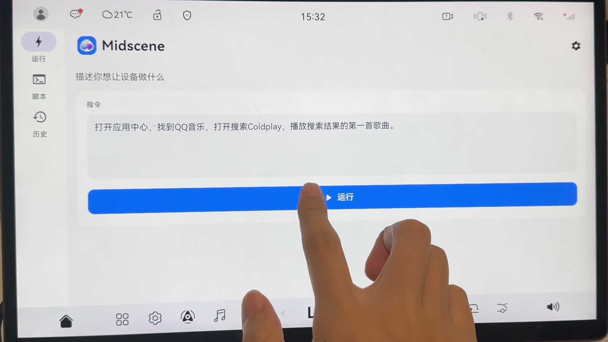
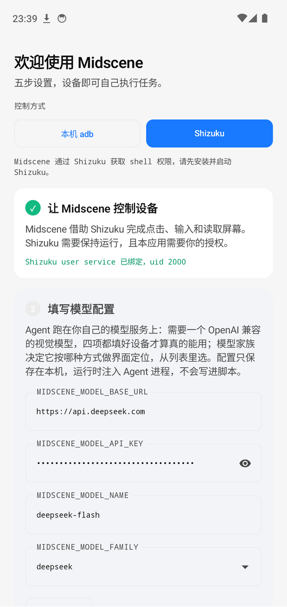
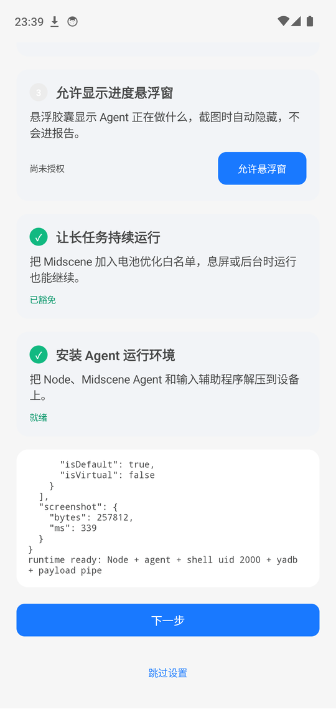

# midscene-android

[English](./README.md) | **简体中文**

**在手机上完成 AI 视觉自动化 —— 不需要电脑，不需要云。**

> ⚠️ **社区项目。** 本项目基于 [Midscene](https://github.com/web-infra-dev/midscene)
> 构建，是一个社区扩展。它**不是 Midscene 官方项目**，也不受 Midscene 团队支持或背书。
> Midscene 在这里作为底层 agent 框架使用（MIT）。
>
> npm 上：本项目是 **`midscene-android`（无 scope）**。官方与 Android 相关的包是
> **`@midscene/android`（带 scope）** 以及 `@midscene/android-local` 包。
> scope 就是官方与社区的边界 —— 请不要混淆。

本项目把 Midscene 的视觉 agent 和它运行所需要的一切 —— Node 运行时、agent bundle、
adb 客户端 —— 一起打包进一个 APK。安装之后，手机自己就能跑自动化脚本：

- 给它一句自然语言指令，agent 会看屏幕并操作它
- 跑 YAML 脚本，做可重复的回归检查
- 推理在端侧完成（模型端点由你配置）；**我们不会把任何数据上传到我们自己运营的第三方服务器**

```text
自然语言 / YAML ──► 端侧 agent ──► 屏幕理解 ──► 设备控制
                        ▲
                   模型端点（你自己的）
```

## 为什么做端侧

Android UI 自动化通常只有两条路：在电脑上写脚本、用数据线驱动手机；或者用远程设备池
（云真机），手机放在别人的机架上。本项目是第三条 —— **agent 跑在手机本身**，而下面的
差别几乎都来自一件事：**你不需要那台电脑。**

|  | 本项目 | 电脑 + 数据线 | 远程设备池（云真机） |
|---|---|---|---|
| 跑起来需要 | 一台手机 | 电脑、数据线、adb | 账号，以及别人的手机 |
| 运行在哪 | 手机自己的屏幕上，看得见、按得停 | 手机上，但由电脑驱动 | 你看不见的某台手机 |
| 离开设备的数据 | 提示词和截图，发往你配置的模型端点 | 同上 | 同上，外加厂商自己留下的部分 |
| 同时跑几台 | 一台 | 每台电脑一台 | 租多少台就跑多少台 |

**另外两条路更好的地方。** 写用例和调试在电脑上更舒服：真正的编辑器、真正的调试器、
能 grep 的日志。而想同时跑二十台手机，只有远程设备池做得到。如果这正是你要的，就用它们。

**本项目适合什么。** 一台手机 —— 在你手上，或者放在身边没有电脑的地方 ——
现在就跑一次检查，并且当场读到报告。

**设计承诺（不只是功能）**

- **始终可见** —— 运行时显示可打断的进度悬浮层。本项目不做隐藏运行。
- **默认本地** —— 我们不运营任何服务器。模型请求直接发往你配置的端点。
- **凭据保持私密** —— 模型凭据存放在应用私有存储中，绝不放进共享存储。
- **运行时可溯源** —— 原生运行时（Node、adb）来自固定版本、经 SHA-256 校验的包。

## 看它跑一遍

<p align="center">
  <a href="docs/demo/">
    
  </a>
</p>

**[看演示（2 分 20 秒）→](docs/demo/)** ——
鸿蒙车机（Android 12）上输入一条指令，背后是
`qwen3.8-flash`：打开应用中心，找到QQ音乐，打开搜索Coldplay，播放搜索结果的第一首歌曲。
应用中心是智能体自己找到的，搜索是在 QQ音乐 里完成的，播放的是搜索结果第一条 ——
点下「运行」之后屏幕再没被碰过。1080p 片段提交在 `docs/demo/` 下，在浏览器播放器里
播放；[4K 原片](https://github.com/lhuanyu/midscene-android/releases/tag/demo-v1)
是 release 附件，有意不进 git。

## 安装

从 [Releases](https://github.com/lhuanyu/midscene-android/releases) 页面下载
`midscene-android-<version>-build<n>-<timestamp>.apk`。

校验下载文件 —— **建议做**，因为这个应用能操作你的手机：

```bash
# 校验摘要
sha256sum -c SHA256SUMS

# 把签名证书指纹和 release notes 里公布的值做比对
apksigner verify --print-certs midscene-android-*.apk
```

要求：**arm64**、Android 10+（`minSdk 29`）。通过无线调试配对需要 Android 11+。

## 首次运行

<p align="center">
  
  
</p>

打开 Midscene 会看到五步引导，每完成一步就会打上勾：

1. **让 Midscene 控制设备** —— 选择 shell 通道（见下）。用 Shizuku 的话，这里会确认授权状态。
2. **填写模型配置** —— Base URL、API Key、模型名和模型家族。
   「测试连接」会让端点回一个单词，所以 key 或模型名写错会**在这里**失败，而不是跑到一半才炸。
3. **允许显示进度悬浮窗** —— 就是显示 Agent 在做什么的胶囊。截图时它会自动隐藏，**不会进报告**。
4. **让长任务持续运行** —— 加入电池优化白名单，息屏后任务也能跑完。
5. **安装 Agent 运行环境** —— 把 Node、Agent 和输入辅助程序解压到设备上。**不需要联网**，全部在 APK 里。

引导全部完成后会自动消失，页面改显示指令输入框和最近一次运行。之后：

- 在 **Run** 里输入一句指令 —— 或者打开 **Scripts** 编辑并运行 YAML 配置
- 在 **History** 里查看报告和日志（最多保留 50 次运行 / 300 MB）

凭据保存在应用私有目录，运行时才注入 Agent 进程；**不会**写进脚本或报告。

### 四个字段之外

表单覆盖的是 Agent 跑不起来就缺不了的项。除此之外 **Midscene 从环境变量读的
任何设置都可用**，因为凭据文件是整份传给 Agent 进程的。把凭据页切成
**「.env 模式」**可以直接编辑；留在表单模式则用 **「粘贴 .env」** 合并一段进去
—— 没提到的键原样保留。

```bash
# 一次 aiAct 最多重规划几轮（默认 20）
MIDSCENE_REPLANNING_CYCLE_LIMIT=40

# 单次请求超时、重试、采样
MIDSCENE_MODEL_TIMEOUT=120000
MIDSCENE_MODEL_RETRY_COUNT=3
MIDSCENE_MODEL_TEMPERATURE=0

# 给「看懂屏幕」和「规划下一步」配各自的模型
MIDSCENE_INSIGHT_MODEL_NAME=...
MIDSCENE_PLANNING_MODEL_NAME=...
```

依赖某个变量之前，有两点要知道：

- **只有 Midscene 认识的变量名才生效**。不认识的会被注入进程然后**静默忽略** ——
  拼错一个字母和没写是一样的。
- **不是数字的值会静默回落默认值**，不报错。所以 `=abc` 同样是静默的。

完整清单就是 [Midscene 文档](https://midscenejs.com/zh/model-common-config.html)
里的 `MIDSCENE_*`；本项目没有自创任何变量名。把粘贴的 `.env` 当作代码看待：
它会被原样传给 Agent 进程，**只粘贴你自己写的**。

## Shell 通道

agent 需要 shell 权限才能操作系统 UI。有两条通道，**推荐 Shizuku**：

| 通道 | 配置方式 | 说明 |
|---|---|---|
| **Shizuku（推荐）** | 安装并启动 Shizuku，然后给 Midscene 授权 | 授权是显式的、可按应用审计。**不会留下任何网络监听。** |
| 本机 adb | 打开无线调试，在应用里配对 | 不需要第二个应用；但它会在设备上跑一个 adb server，**同机的其他应用**可以访问。请只在信任的设备上使用。 |

> adb 通道的信任边界：它在设备上跑一个 adb server，并通过 loopback 与之通信，
> 而 adb 的 host 协议**没有客户端认证**。因此同机的其他应用原则上可以使用这条通道。
> **如果你不完全信任设备上的其他应用，请使用 Shizuku 通道。**
> 详见 [SECURITY.md](./SECURITY.md)。

## 从源码构建

前置条件：根 `package.json` 里指定的 Node 与 pnpm 版本、JDK 17、Android SDK platform 35、
Python 3、`zip`、`curl`，以及 `tar`（或者在 `tar` 读不了 Debian 归档的平台上用 `ar`）。

```bash
pnpm install --frozen-lockfile
pnpm run assemble                                  # -> apps/android-host/app/build/outputs/apk/debug/app-debug.apk
pnpm --dir apps/android-host run install:apk       # 用 adb 安装到已连接的设备
```

> 安装脚本叫 `install:apk` 而不是 `install`，因为 npm 和 pnpm 会把字面名为 `install`
> 的脚本当作生命周期钩子，在每次 `pnpm install` 时执行它 —— 并且失败。

`assemble` 会构建 workspace 包、从 Termux 下载固定版本的 arm64 Node 与 adb 包
（经 SHA-256 校验，缓存在被 git 忽略的 `apps/android-host/.cache/`）、构建 JS bundle，
然后跑 Gradle。它产出的是 **debug** 包 —— release 构建见下。

## Release 构建与签名

release APK 必须使用显式的签名密钥：

```bash
MIDSCENE_KEYSTORE=... MIDSCENE_KEYSTORE_PASSWORD=... \
MIDSCENE_KEY_ALIAS=... MIDSCENE_KEY_PASSWORD=... \
pnpm run assemble:release
pnpm --dir apps/android-host dist:release   # -> apps/android-host/dist/midscene-android-<version>-build<n>-<ts>.apk
```

这四个值也可以放在被 git 忽略的 `apps/android-host/local-signing.properties` 里
（环境变量优先）。**请把签名密钥和它的密码放在仓库之外。**
debug 与 release 的签名不同，所以用 release 包替换 debug 安装需要先卸载 ——
这会同时清掉已保存的凭据和配对密钥。

本地测试密钥可以用 `apps/android-host/scripts/make-release-keystore.sh` 生成，
它也读同一组环境变量，产物被 git 忽略。

## 测试

```bash
pnpm run build        # 构建 agent 运行时包
pnpm test             # 设备运行时单测（200+ 用例，不需要设备）
pnpm run test:android # Android JVM 单测（15 个测试类），需要 Android SDK
pnpm run lint         # Biome
```

APK 行为必须在 arm64 真机或模拟器上验证；依赖模型的运行需要先配置好模型凭据。

## 已知限制

- 模型凭据以**明文**存放在应用私有的 `model.env` 里。
  **不要在你不信任的设备上使用生产环境的 API Key。**
- 仅支持 arm64；`minSdk 29`。
- 无线调试在重启后可能需要重新打开。
- 内置的 adb 客户端和 Node 运行时是第三方预编译的 arm64 包（来自 Termux），
  已固定版本并做 SHA-256 校验。详见 [SECURITY.md](./SECURITY.md)。

## 本项目不会做的事

以下能力**被刻意排除在范围之外**；相关功能请求不会被接受：

- 多设备控制 / 批量操作
- 批量账号操作（注册、登录、养号）
- 反检测、风控规避，或设备指纹伪造
- 绕过设备安全机制（锁屏、提权、持久化）
- 任何形式的静默或隐藏运行

理由很直接：这些能力的主要用途是滥用，而且它们与「始终可见、完全本地」的设计承诺
根本冲突。详见 [CONTRIBUTING.md](./CONTRIBUTING.md)。

## 许可证

MIT，与 [Midscene](https://github.com/web-infra-dev/midscene) 一致。
本项目把 Midscene 作为依赖使用，但**不是官方项目**。
